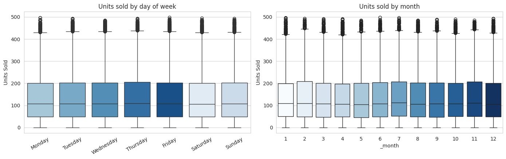
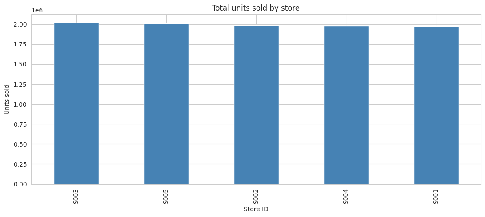
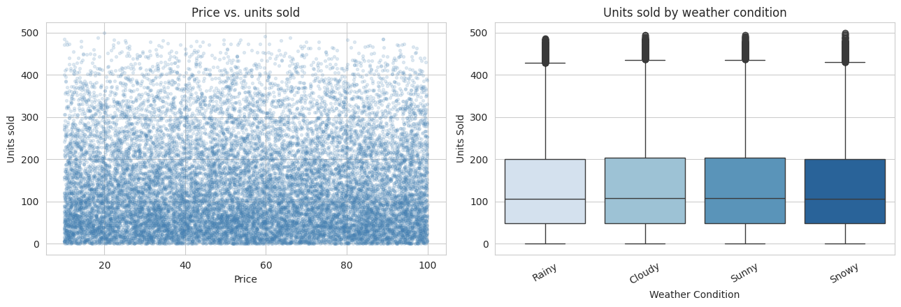
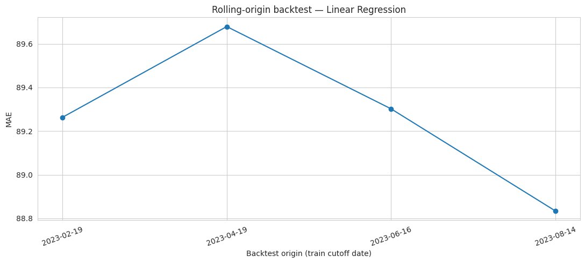
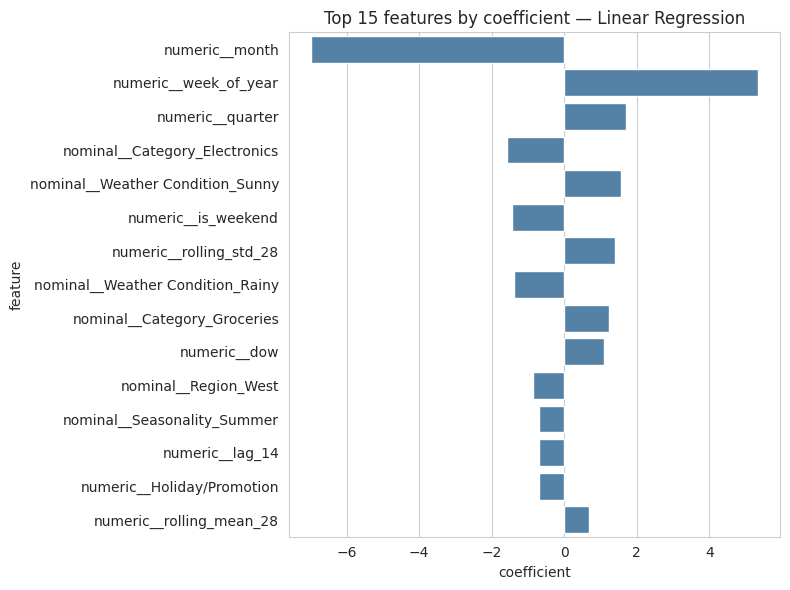

# Retail Demand Forecasting & Inventory Optimization

Forecasts daily `Units Sold` per store-product from the [Retail Store Inventory Forecasting Dataset](https://www.kaggle.com/datasets/anirudhchauhan/retail-store-inventory-forecasting-dataset), then uses that forecast to flag stockout risk and recommend reorder quantities.

## Setup notes

The dataset ships a `Demand Forecast` column, which is left out of both the features and the target it's someone else's model output, and training on it would just teach this model to imitate that one. Price, discount, promotion, holiday, and weather are treated as known ahead of time, since retailers set these in advance. Only `Units Sold` gets lagged, so no row sees its own future.

## EDA

Total daily volume is noisy but stationary no trend, no visible seasonality across two years:

Day-of-week, month, store, price, and weather all come back essentially flat. Same median, same spread, no separation anywhere:

Correlation between price and units sold: 0.0011. Discount: 0.0026. This is the first hint of what the ablation study confirms later the demand signal in this dataset doesn't live in any of the "obvious" retail drivers.

## Pipeline

Data is loaded through a column resolver (headers vary across dataset versions), then parsed, sorted by store/product/date, deduplicated, and normalized. Features combine calendar fields (day of week, month, quarter) with lags (1/7/14/28 days) and rolling mean/std (7/14/28-day windows) of `Units Sold`, all shifted by one day so nothing sees itself.

A leakage check on `Inventory Level` came next it correlates with same-day sales (r = 0.59), but you can't actually know today's inventory before today's sales happen. Three variants were tested (same-day, dropped, lagged), and the switch to `inventory_lag_1` was made regardless of the numbers, since same-day just isn't obtainable at prediction time.

Training used a chronological 70/15/15 split and compared:
- naive lag-1 and 7-day moving average baselines
- Linear Regression
- tuned Random Forest, XGBoost, and LightGBM (`RandomizedSearchCV` + `TimeSeriesSplit`)

An ablation study added feature groups one at a time (calendar → lags → rolling → price/promo → weather) to see which actually moved validation MAE. The best model by validation score was refit on train+val and scored once on test that's the number that counts. Rolling-origin backtesting across four origins confirmed it wasn't a fluke of one split:

MAE holds steady at ~89 regardless of where the cutoff falls, which is really a stability check, not a performance one a flat line here means the earlier single test score wasn't a lucky split, not that 89 is a good number.

## Inventory decision layer

The forecast feeds a small decision layer. A 7-day forecast uses a recursive rollout predict day 1, feed that back into the lag/rolling features, predict day 2, and so on rather than just repeating one day's prediction, which would miss day-of-week effects. Safety stock assumes a fixed lead time and 95% service level (z ≈ 1.65) applied to historical forecast error, standing in for real demand uncertainty since neither figure is in the dataset. From there, `stockout_risk` flags when current inventory falls short of forecasted lead-time demand plus the safety buffer, and `recommended_order_qty` closes that gap using the most recent *actual* inventory reading, which is fine since it's observed, not predicted.

## What actually helped

Engineered features (lags, rolling stats, price/promo/weather) added very little lift EDA, the ablation study, and the backtest all pointed the same way, likely a quirk of this particular synthetic dataset rather than a general fact about retail demand. Linear Regression stayed competitive with the tree models, and its coefficients are the most direct evidence of *why*:

`month` and `week_of_year` dominate every lag and rolling feature combined a linear model is leaning almost entirely on calendar position, not on anything derived from past sales. That's consistent with the residuals, which sit close to zero but skew with a long right tail the model underpredicts a subset of high-volume days more than it overpredicts low ones:

## Limitations

- Single combined time-series split rather than per-series CV
- Lead time / service level in the reorder math are placeholders, not real supply-chain numbers
- Store/product IDs are ordinal-encoded, so this won't generalize to unseen stores or products
- Safety stock assumes normal-distributed error; a stricter version would use quantile forecasting instead
