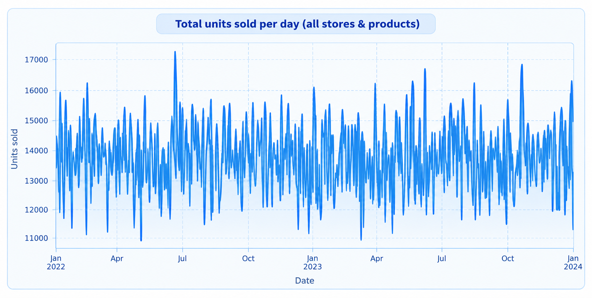
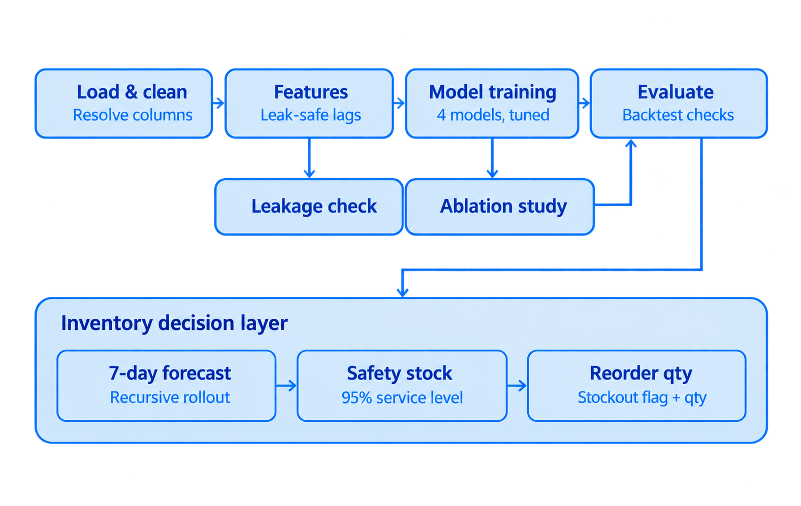
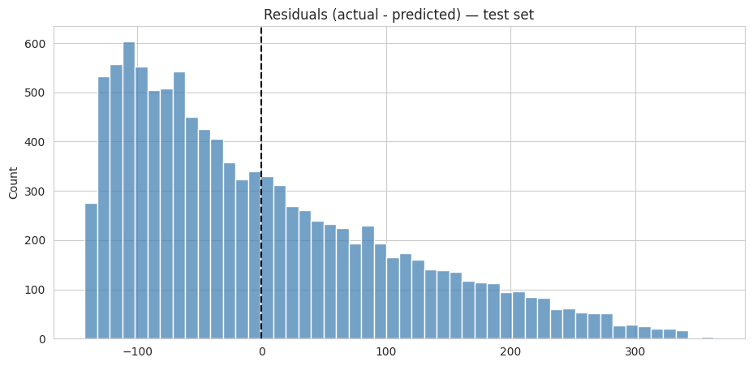
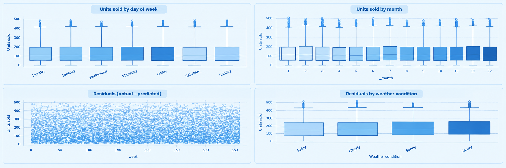
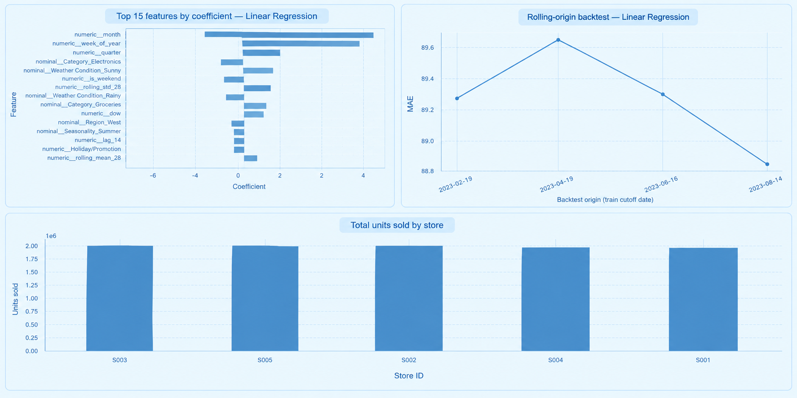

# Retail Demand Forecasting & Inventory Optimization

Daily demand forecasting for a synthetic multi-store, multi-product retail chain: predict `Units Sold`
per store-product-day, then turn that forecast into a stockout flag and a reorder quantity. The
interesting part isn't the modeling it's what *doesn't* help. Engineered features barely move the
needle, and a linear model ties three tuned tree ensembles, which says more about this dataset than
about forecasting in general.

## Dataset

Kaggle "Retail Store Inventory Forecasting Dataset" 73,100 rows, 5 stores × 20 products, daily,
2022-01-01 to 2024-01-01. Comes with sales, inventory, pricing, promotions, weather, and holidays.

The dataset also ships a `Demand Forecast` column. It's dropped entirely it's someone else's model
output, and training on or against it would just teach this model to imitate that one, not to learn
from actual sales.

## Method

Price, discount, promotion, holiday, and weather are treated as known ahead of time, since a retailer
sets these in advance and weather forecasts exist. Only `Units Sold` itself is lagged (1/7/14/28 days)
and rolled into 7/14/28-day means and 7/28-day stds, with the rolling stats built on a `shift(1)`
series so a day never sees its own value.

**The one leak worth catching:** same-day `Inventory Level` correlates 0.59 with same-day sales and
drops validation MAE from 89.8 to 68.8 if you let a model use it but that's not signal, it's
look-ahead. Today's inventory isn't known before today's sales happen. Swapping in yesterday's
inventory (`inventory_lag_1`) brings the MAE right back to 89.8, matching a model that drops the
column entirely. The correlation was real; the feature just wasn't usable at prediction time.

Chronological 70/15/15 split (train → 2023-05-27, val → 2023-09-14, test → 2024-01-01). Four models
compared under the same feature set, each tuned with `RandomizedSearchCV` over a 5-fold
`TimeSeriesSplit`: Linear Regression, Random Forest, XGBoost, LightGBM.

## Results

Baselines vs. tuned models, validation set:

| Model | MAE | RMSE | WAPE |
| --- | --- | --- | --- |
| Naive (lag_1) | 121.8 | 156.3 | 89.1% |
| Moving average (7-day) | 94.5 | 117.4 | 69.1% |
| Linear Regression | **89.8** | 109.8 | 65.7% |
| Random Forest (tuned) | 89.9 | 109.8 | 65.7% |
| XGBoost (tuned) | 89.9 | 109.8 | 65.7% |
| LightGBM (tuned) | 89.9 | 109.9 | 65.7% |

Linear Regression wins by a hair and is what goes to test. Final test-set score:
**MAE 88.4, RMSE 107.9, WAPE 64.8%** refit on train+val, evaluated once.

Ablation (calendar → lag → rolling → price/promo → weather), validation MAE:

`90.33 → 90.09 → 90.05 → 89.94 → 89.93`

Every group of engineered features helps a little and none of them help much. Combined with the
day-of-week/month boxplots below showing almost no spread by day or season, and price/discount
correlating with sales at ~0.001–0.003, the read is that this particular synthetic dataset has very
little real signal to extract beyond the mean not a general claim about retail data.

 

Rolling-origin backtest across 4 train cutoffs stays tight (MAE mean 89.3, std 0.35) the score
isn't an artifact of one lucky split.

 

## Bonus: forecast → reorder quantity

7-day-ahead forecasts are built recursively (forecast day 1, feed it back in to build day 2's lag
features, and so on) rather than by repeating a 1-day prediction 7 times, so day-of-week effects and
compounding error are both preserved. That forecast plus a 95%-service-level safety stock
(`z ≈ 1.65` over the model's own historical error, lead time 7 days) becomes a reorder point:
inventory below that point gets flagged at-risk, with a recommended order quantity to close the gap.

## Key findings & limitations

- The look-ahead bug in `Inventory Level` was the most consequential thing found here easy to miss
  since it looks like a legitimate, strongly-correlated feature.
- Linear Regression tying three tuned tree ensembles is itself a finding: there isn't much nonlinear
  structure in this data for them to exploit.
- Limitations: CV was done on the pooled timeline rather than per-series, lead time / service level
  in the reorder math are placeholders rather than real supply-chain parameters, and ordinal
  store/product IDs won't generalize to a store or product not seen in training.
- Next: quantile regression for real prediction intervals, hierarchical forecasting, per-series CV,
  real supply-chain parameters in place of the placeholders.